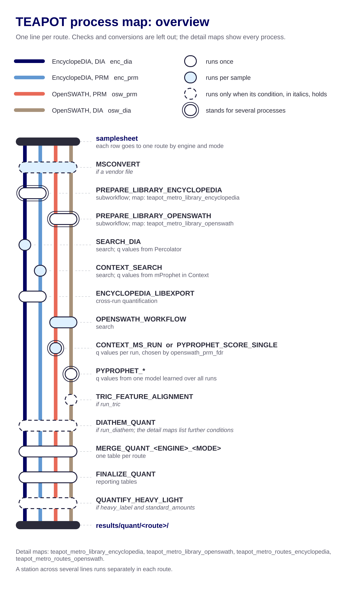

# TEAPOT internals

For developers.

---

## 1. Layout and routing

```
main.nf                 samplesheet parsing, pre-flight checks, routing. Runs no tools itself
nextflow.config         every parameter and its default; profiles
conf/base.config        resource defaults, always included
conf/slurm.config       site overrides, added with -c
subworkflows/local/     7: four routes, PREPARE_LIBRARY_ENCYCLOPEDIA/_OPENSWATH, PREPARE_BACKGROUND
modules/local/<domain>/ 46 processes, one per file
bin/                    Python called by modules, on PATH inside every task
lib/                    Groovy helpers, loaded automatically by Nextflow
assets/                 patch for contextbook, read from projectDir
templates/              params, samplesheet and launcher templates
figs/                   figures
*.md                    docs
```

`main.nf` sends each samplesheet row to one route by `engine` (default
`encyclopedia`) and `mode`:

| engine | mode | subworkflow | route label |
|---|---|---|---|
| encyclopedia | DIA | `ENCYCLOPEDIA_DIA` | `enc_dia` |
| encyclopedia | PRM | `ENCYCLOPEDIA_PRM` | `enc_prm` |
| openswath | DIA | `OPENSWATH_DIA` | `osw_dia` |
| openswath | PRM | `OPENSWATH_PRM` | `osw_prm` |

Before routing, vendor files (`.raw`, `.wiff`, `.wiff2`, `.d`, `.lcd`) go through
`MSCONVERT`; `.mzML`/`.mzXML` pass through, and `.dia` is accepted on
EncyclopeDIA routes only. Library preparation runs once per engine:
`PREPARE_LIBRARY_ENCYCLOPEDIA` for the EncyclopeDIA routes,
`PREPARE_LIBRARY_OPENSWATH` for the OpenSWATH routes. Both call
`PREPARE_BACKGROUND` when `background_source` is not `none`.

Every route ends the same way: `MERGE_QUANT_<ENGINE>_<MODE>` builds one long
table, `FINALIZE_QUANT` writes the reporting tables, and `QUANTIFY_HEAVY_LIGHT`
runs when `heavy_label` is set and `standard_amounts` is given. Four mergers exist
because the routes expose abundance differently; `FINALIZE_QUANT` is shared, so
the output shape does not depend on the route.

The process map shows every process each route passes, and the condition under
which an optional one runs:



## 2. Naming

The process name is the file name uppercased, and a `bin/` script is named after
the module that calls it. File names fall into three families:

| family | shape | used for | examples |
|---|---|---|---|
| action | `verb_object` | a step we implement | `harmonize_rt`, `complete_channels`, `strip_reference_decoys` |
| conversion | `<from>_to_<to>` | format in, format out | `blib_to_dlib`, `dlib_to_openswath_tsv`, `pyprophet_to_psm` |
| tool wrapper | `<tool>_<subcommand>` | a thin wrapper around a named upstream command | `openswath_workflow`, `pyprophet_learn`, `encyclopedia_libexport` |

Tool wrappers keep upstream's spelling (`OPENSWATH_WORKFLOW` after
`OpenSwathWorkflow`) so the name can be searched in the tool's own documentation.

Otherwise: `snake_case` and no abbreviations (`openswath`, not `osw`), except in
route labels, output paths and the alias `OSWPRM_CONTEXT_SEARCH`. Tool-specific
params are prefixed with the tool. Subworkflows are `<engine>_<mode>` or
`prepare_<thing>[_<engine>]`; templates are `<engine>_<acquisition>[_<variant>]`.
Most processes publish to `<outdir>/<process name in lowercase>`, some override it.

Renaming a process means changing its file, its `include`, and its `withName`
selectors in both configs. A stale selector raises no error: the process silently
gets the generic resources (16 GB) instead.

### Context and Context-MS

Two programs with similar names.

* **Context** is Java inside our EncyclopeDIA fork (`contextbook`), run as
  `edu.washington.gs.maccoss.encyclopedia.context.ContextMProphetExecutor` by
  `CONTEXT_SEARCH`. It searches and scores. It is the EncyclopeDIA PRM route, and
  it also runs on OpenSWATH PRM as `OSWPRM_CONTEXT_SEARCH` when
  `openswath_prm_encyclopedia_quant` is set.
* **Context-MS** is a Python package in its own image, run as
  `python3 -m context run` by `CONTEXT_MS_RUN`. It does not search: it rescores
  features OpenSwathWorkflow already extracted. It is the default confidence
  estimation option on the OpenSWATH PRM route.

TEAPOT uses neither image named `ghcr.io/shannon225/context`. The images it runs
are `params.encyclopedia_container` and `params.context_container`.

### reference list and mass list

"Reference list" is our term: the samplesheet column `reference_list`, the param
`reference_list_decoy_jar`, the modules `add_decoys_to_reference_list`,
`blib_to_reference_list`, `dlib_to_reference_list`, `strip_reference_decoys`, and
all documentation. "Mass list" appears only where EncyclopeDIA's own names force
it: the `-massList` flag, `MassListDecoyGenerator`,
`IsolationWindowReader.parseMassList`,
`ContextFeatureScorer.findMatchingMassListWindow`, and
`assets/masslist-decoys.jar`. `main.nf` errors on `mass_list` in the samplesheet.
Write `reference_list` in anything new.

## 3. Modules

### `encyclopedia/`

| module | does |
|---|---|
| `search_dia` | EncyclopeDIA search. Outputs are named after the full input file name, because EncyclopeDIA appends suffixes |
| `search_gpf`, `merge_gpf` | search gas-phase fractionation (GPF) runs; merge several fractions into one `.dia` |
| `context_search` | Context: rescores the reference peptides with a model trained on the background |
| `encyclopedia_libexport` | one `-libexport` call: builds a chromatogram library, or the cross-run quant `analysis.elib` |
| `encyclopedia_libexport_per_sample` | a per-sample `.elib` on the PRM route, which the pooled libexport needs for alignment |
| `koina_predict` | FASTA to predicted `.dlib` through Koina |
| `blib_to_dlib` | `.blib` to `.dlib` |
| `blib_to_reference_list` | `.blib` to a reference list (`Compound`, `m/z`, `z`, RT columns) |
| `dlib_to_reference_list` | `.dlib`/`.elib` to the same shape, for diathem. Included twice, the second as `ELIB_TO_REFERENCE_LIST` |
| `dlib_to_openswath_tsv` | `.dlib` to an OpenSWATH transition TSV, mapping delta masses to UniMod |
| `add_decoys_to_reference_list` | adds reversed decoys to a reference list, using `assets/masslist-decoys.jar` |

### `library/`

| module | does |
|---|---|
| `complete_channels` | synthesizes the missing light or heavy twin of each peptide, in either direction, skipping entries whose twin exists and proteins in `complete_channels_skip_proteins` |
| `emit_irt_library` | extracts iRT anchors (and an OpenSWATH iRT TSV) from the original `.blib`, not the channel-completed one |
| `derive_irt_from_reference_list` | iRT anchors from the reference list's RT column (OpenSWATH routes, non-`.blib` sources) |
| `harmonize_rt` | regresses a library's RT onto the anchor scale; can emit a full-window flag when `rt_harmonize_fallback: full_window` |
| `merge_libraries` | unions the reference and background libraries (SQLite) |
| `assert_rt_coherent` | stops if the two halves of a merged library are not on one RT scale |
| `assert_background_adequate` | stops if the background has fewer than `background_min_targets` peptides |
| `strip_reference_decoys` | decoy-free copy of the reference list, for diathem |

### `openms/`, `context_ms/`, `pyprophet/`, `tric/`

| module | does |
|---|---|
| `assert_openswath_feasible` | measures spectral occupancy before the OpenSWATH PRM search and detects nested survey windows (§7) |
| `openswath_assay_generator` | selects transitions; first stops on duplicated `transition_name` values |
| `openswath_decoy_generator` | appends decoys and writes `library.pqp`; stops on an empty library |
| `openswath_workflow` | the OpenSWATH search |
| `extract_openswath_intensity` | peak areas from the `.osw` |
| `split_openswath_features`, `context_ms_run` | split features into reference and background, then rescore with Context-MS |
| `pyprophet_score_single`, `pyprophet_to_psm` | the pyprophet alternative on OpenSWATH PRM: one model per run, reshaped to Context-MS's output columns |
| `pyprophet_subsample`, `_merge`, `_learn`, `_apply`, `_export` | OpenSWATH DIA: one model learned over all runs, applied to each |
| `assert_search_productive` | stops if the FDR step identified nothing (PRM routes) |
| `tric_feature_alignment` | cross-run alignment, OpenSWATH DIA only, when `run_tric` |

### `diathem/`, `quant/`

| module | does |
|---|---|
| `diathem_quant` | interference-corrected quantification over all runs of a route |
| `augment_context_features` | adds diathem's statistics to Context-MS features (`augment_context_with_diathem`, OpenSWATH PRM) |
| `merge_quant_<engine>_<mode>` | joins identifications and every tool's abundance into one long table |
| `assert_quant_productive` | stops if the quantification `analysis.elib` matched no fragment ions (EncyclopeDIA routes) |
| `finalize_quant` | `quant.full/.confident/.reference.tsv` and `quant_summary.tsv` |
| `quantify_heavy_light` | light/heavy pairs and absolute pmol |

### `bin/` and `lib/`

`bin/` holds the longer Python bodies: `harmonize_rt.py`, `complete_channels.py`,
`merge_libraries.py`, `assert_rt_coherent.py`, `emit_irt_library.py`,
`derive_irt_from_reference_list.py`, `assert_openswath_feasible.py`. Shorter
modules inline their Python in a heredoc.

`lib/` is required at start-up:

* `Args.groovy`: `flat()` collapses multi-line param strings; `inherit()` copies
  the search flags in `INHERITED_FLAGS` (`-ftol`, `-ptol`, `-frag`, `-fixed`,
  `-enzyme` and their unit/offset flags) into the libexport calls, so quantification
  uses the same tolerances as the search.
* `Fingerprint.groovy`: hashes a file or directory (the EncyclopeDIA jar) into the
  task script, so a rebuilt jar invalidates `-resume` caching.

### Decisions behind the modules

**Reference-list decoys differ by engine.** Context's mProphet needs reference
decoys to estimate a reference-side FDR.

* EncyclopeDIA: the reference list is the target set, so decoys are added to the
  list. `ADD_DECOYS_TO_REFERENCE_LIST` runs on a list derived from a `.blib`, and on
  a supplied list that `reference_list_has_decoys()` in `main.nf` finds without
  decoy rows (both gated on `add_decoys_to_reference_list`).
* OpenSWATH: decoys come from the `.pqp`. `SPLIT_OPENSWATH_FEATURES` reads
  `P.DECOY` from the `.osw` and pairs a decoy to its target through
  `DECOY_<target TRAML_ID>`. It uses the reference list only as a set of sequences.
  `main.nf` adds no decoys to an OpenSWATH PRM list, because the same file feeds
  iRT anchor derivation.

**User decoys in an OpenSWATH library are replaced.** Every OpenSWATH source except
`--openswath_pqp` goes through `OPENSWATH_ASSAY_GENERATOR` then
`OPENSWATH_DECOY_GENERATOR`. The assay generator drops decoy entries, and the decoy
generator appends its own, named as the pairing above expects. `--openswath_pqp` is
used as supplied. If its decoys are not named `DECOY_<target TRAML_ID>`, pairing
fails, every reference $q$ value becomes 1, and `SPLIT_OPENSWATH_FEATURES` only warns.

**FDR output is read at peptide level.** Context-MS and pyprophet both write PSM-
and peptide-level tables; the mergers read the peptide level. The PSM table would
admit a peptide when any one spectrum match passed, with no error rate at that
level, and would give one row per match.

#### diathem is under ongoing development

diathem is currently integrated into TEAPOT in its present state, but remains
under active development and subject to future updates.

**diathem's target list.** `diathem quant --targets` reads a `.pqp` or a delimited
list with `Compound`, `m/z`, `z`. OpenSWATH routes pass their `.pqp`. EncyclopeDIA
PRM always has a reference list. EncyclopeDIA DIA without a reference list or `.blib`
gets one from `DLIB_TO_REFERENCE_LIST` / `ELIB_TO_REFERENCE_LIST`. The `.elib`
variant writes RT as minutes; the `.dlib` variant leaves RT empty, because a
predicted library's `RTInSeconds` may be iRT. diathem skips the RT filter for
targets without RT, and the DIA branch uses `--rt-window 0` (whole run). This
derived list feeds diathem only; `FINALIZE_QUANT` still gets the real reference
list or `NO_FILE`, otherwise `quant.reference.tsv` would cover the whole library.

`STRIP_REFERENCE_DECOYS` gives diathem a decoy-free list on EncyclopeDIA PRM,
EncyclopeDIA DIA, and OpenSWATH PRM (`diathem_targets_source: reference`). diathem
has no decoy model, and its list reader ignores a decoy column. The `.pqp` reader
filters `DECOY = 0` itself, so OpenSWATH DIA needs no stripping. The library given
to diathem keeps its decoys: it is only a fragment-ratio prior looked up by
sequence and charge.

**Which runs reach diathem.** diathem reads `*.mzML` only (pyteomics), and needs
every MS2 spectrum to carry an isolation-window target m/z and a scan start time,
one spectrum per time point. On the EncyclopeDIA routes `main.nf` enables
`DIATHEM_QUANT` when a row of the route names a `.raw`, `.mzML` or `.mzXML` file
(`diathemable`); on the OpenSWATH routes it is enabled whenever `run_diathem` is
set. `DIATHEM_QUANT` then links `mzml_in/<stem>.mzML` to `mzml_dir/<sample_id>.mzML`
using the `sample_map` stems, because the mergers take diathem's `run_id` as
`sample_id`.

**Gap to fix next:** that link only works when the mzML is named
`<samplesheet file stem>.mzML`. `MSCONVERT` does not always write that name (a
`.wiff` gave `<name>-001.mzML`), and the stem of an `.mzXML` row points at a file
that is not mzML. In those cases nothing is linked and `diathem quant` exits with
an error. The fix belongs in the channels, where `meta.id` is known, not in name
matching inside the module.

## 4. Containers

`nextflow.config` sets `process.container = params.encyclopedia_container` above
the profiles, so the EncyclopeDIA image is the default and every other module
names its own. No profile can omit it. `label` directives are informational; no
config uses `withLabel`.

| image | param | pinned by | modules |
|---|---|---|---|
| EncyclopeDIA fork | `encyclopedia_container` | version tag `6.8.29-teapot` | the default: `search_dia`, `search_gpf`, `merge_gpf`, `context_search`, both libexports, `koina_predict`, `blib_to_dlib`, `add_decoys_to_reference_list` |
| OpenMS | `openswath_container` | digest | `openswath_workflow`, `_assay_generator`, `_decoy_generator` |
| PyProphet | `pyprophet_container` | digest | the six `pyprophet_*` tool modules |
| Context-MS | `context_container` | tag `main` | `context_ms_run` |
| diathem | `diathem_container` | tag `quant` | `diathem_quant` |
| msproteomicstools | none, hardcoded | tag `latest` | `tric_feature_alignment` |
| ProteoWizard | `msconvert_container` | none | `msconvert` |
| pandas | `python_container` | tag `2.2.1` | the other 24: all of `library/` and `quant/`, every other `assert_*`, and the Python conversions |

OpenMS and PyProphet were pinned by digest after `latest` changed their CLIs
mid-development. Images still on moving tags can change under you.

The Python image must contain pandas and `ps`: the Nextflow task wrapper exits
without `ps`, and installing pandas at task time needs network and a writable
`$HOME`, which apptainer may not give.

Tool quirks:

* **Context-MS** has no `context` executable on PATH; use `python3 -m context run`.
* **msconvert** is Windows software under Wine (`mywine msconvert`). It needs a
  writable Wine prefix, bound from `/dev/shm` by `containerOptions`.
* **Koina** is an HTTPS API, nothing installed. The fork adds a missing trailing
  `/` to `koina_url`. Model names use underscores (`Prosit_2020_HCD`).
* **EncyclopeDIA image**: CI in `contextbook` builds and pushes it on every push to
  the `teapot` branch, tagged with the `pom.xml` version. The base is
  `eclipse-temurin:17-jre-jammy`: the floating `17-jre` tag moved to a base whose
  `date` ignores `%3N`, and Nextflow's wrapper needs 13 digits there, so every
  task failed. CI now checks the digit count.
* **`assets/masslist-decoys.jar`** ships in the repo (§9). A local EncyclopeDIA
  jar can be built with `tools/build_encyclopedia.sh` and used through
  `encyclopedia_jar`, which otherwise points inside the image.

## 5. Configuration

`conf/base.config` is always included. It sets 2 CPUs, 4 h and 16 GB for every
process, plus per-process `withName` blocks sized by what the data needs (for
example 96 GB for `HARMONIZE_RT` and `MERGE_LIBRARIES` on large libraries). Tasks
that exit 137, 139 or 143 are retried once, with the same resources.

Memory is requested as SLURM `--mem` inside `clusterOptions`, not with the
`memory` directive. It therefore applies only under the SLURM executor; local
runs are not memory-limited by Nextflow.

`conf/slurm.config` sets `cluster_options` (the account), the container cache
locations, and 16 `withName` blocks covering 20 processes that benefit from larger
nodes. Three of them (`MERGE_LIBRARIES`, `ASSERT_RT_COHERENT`,
`DERIVE_IRT_FROM_REFERENCE_LIST`) repeat `base.config` exactly; keep this file a
delta so the two cannot drift apart.

Resolution order is the generic `process` scope, then `withLabel`, then
`withName`, and a later `-c` file wins. Do not add `withName: '.*'`: it overrode
`--mem` for processes that had their own selector, and `CONTEXT_SEARCH` was
OOM-killed with 16 GB. Put defaults in the generic scope instead.

## 6. Pre-flight

`main.nf` stops before scheduling anything on:

* missing `assets/` files (`NO_FILE`, `unimod_delta_masses.tsv`, `masslist-decoys.jar`)
* unfilled `<...>` template placeholders in any param. The check recurses into
  lists and maps: `complete_channels_skip_proteins: ['<iRT_Tag>']` once passed a
  scalar-only check and matched nothing
* old `channel_complete_*` param names, which Nextflow would otherwise ignore
  silently
* the removed `mass_list` samplesheet column
* an unknown `engine`, a `.dia` file on the OpenSWATH engine, or an invalid
  `background_source`
* PRM rows that would derive their reference list from a `.blib` with
  `background_source: none` (on OpenSWATH PRM only when `openswath_prm_fdr` is not
  `pyprophet`): the reference set would equal the library, leaving nothing to
  train on
* a `.blib` together with `--library_sheet` (unless `background_source: gpf`) or
  `--elib` (unless `background_source: elib`), where the `.blib` would be dropped
* `background_source: koina` without `background_fasta`
* more than one distinct `reference_list` among OpenSWATH PRM rows, because iRT
  anchors from one list are applied to the whole library
* `openswath_prm_encyclopedia_quant` with `--openswath_pqp`, `_tsv` or `_traml`,
  which EncyclopeDIA cannot read
* PRM rows with neither a `reference_list` nor a `.blib`
* a route with fewer runs than `quant_min_runs`, when `quant_require_min_runs` is
  set (otherwise a warning)

## 7. Scan selection and the OpenSWATH feasibility gate

**Why OpenSWATH fails on crowded PRM.** A reversed decoy has its target's precursor
m/z, so OpenSWATH extracts it from the same scans. It scores low only if its
fragment m/z values land on noise. Spectral occupancy, the fraction of the m/z axis
within the extraction tolerance of a real peak, is the chance a decoy transition
hits signal, and it compounds over transitions. Those hits are fragments of
co-isolated peptides, so they also co-elute and correlate, which are OpenSWATH's
scores. In crowded spectra decoys cannot be told apart from targets.

**The gate.** `ASSERT_OPENSWATH_FEASIBLE` runs before `OPENSWATH_WORKFLOW` on the
PRM route (skip with `skip_openswath_feasibility`). It measures median occupancy
at `openswath_occupancy_tolerance` over the targeted-window MS2 scans and stops
above `openswath_max_occupancy` (0.35), or only reports with
`openswath_feasibility_warn_only`. Two details matter:

* measure the narrow targeted windows, not all MS2 scans: interleaved wide survey
  scans can dominate the file and understate occupancy
* measure across the acquisition, not inside one precursor's window, where the
  value follows that peptide's abundance

The gate does not run on OpenSWATH DIA: DIA windows tile the m/z range, and the
threshold was calibrated on scheduled PRM.

**Nested survey windows.** The same script checks whether wide survey windows nest
around the targeted ones. If so, and `openswath_auto_matching_window` is true, it
writes `nested_windows.flag` and `OPENSWATH_WORKFLOW` adds
`-matching_window_only true`. An explicit `-matching_window_only` in
`openswath_search_args` turns the automatic decision off.

**EncyclopeDIA does this inside the jar.** `IsolationWindowFilter` in `contextbook`
keeps, for each precursor, only the scans acquired for its exact isolation window.
It is controlled by the Java property `encyclopedia.exactIsolationWindow` (default
true), which TEAPOT never sets. It does nothing when scans have at most one
distinct window (uniform DIA), and falls back to all overlapping scans when none
match exactly. It is used by `Encyclopedia` (DIA search), `EncyclopediaTwo` (the
Context PRM path) and `PeptideQuantExtractor` (quantification). PARAMETERS.md §10
describes the user-facing behavior.

## 8. Quantification decisions

* **`abundance_primary` is exactly the column of the tool named in
  `primary_abundance`, with no fallback.** A row-wise fallback mixed tools within
  a light/heavy pair and across peptides in one column. Every tool keeps its own
  `abundance_*` column.
* **Absolute-quant tables.** `peptide.abs_quant.long.tsv` carries a
  `method = primary` slice, which `peptide.abs_quant.matrix.tsv` pivots.
  `peptide.pairs.tsv` has one set of rows per tool and excludes that slice, which
  would repeat one tool. `peptide.pairs.confident.tsv` keeps the primary tool's
  pairs whose worse channel $q$ value passes `fdr`.
* **No silent empty tables.** `heavy_label` set but no heavy rows in the merged
  table is an error, and so is a table where both channels exist but no pmol could
  be attached.
* **Zero is missing.** Abundances of 0 become NaN before any ratio; otherwise a
  zero heavy gives an infinite, plausible-looking amount.
* **`min_consistency` gates every tool**, not only diathem: diathem's
  `consistency` describes interference in the peptide's signal, which affects all
  tools' abundances.
* **Protein amount is the median**, first over charge states within a peptide,
  then over peptides. With construct-level standards every peptide estimates the
  same amount, so a sum would scale with the number of detected peptides.
* **Join keys.** Each of these once broke a whole table:
  * charge: Percolator and Context encode it only in `PSMId`
    (`<file>:<rt>:<pepModSeq>+<charge>`)
  * channel: a heavy peptide and its light twin share sequence and charge;
    without `channel` every ratio became 1
  * flanking residues: Percolator writes `-.PEPTIDE.-`, the `.elib` writes
    `PEPTIDE`
  * file name to sample: EncyclopeDIA names outputs after the full input name, so
    `sample_map` stems are matched as prefixes in both directions
* **EncyclopeDIA abundance comes from the `.elib` `peptidequants` table**, which
  keeps precursor charge. `analysis.elib.peptides.txt` sums charges and is read
  only when the `.elib` is missing or empty. libexport writes it only when it
  aligns two or more runs.
* **Standard amounts** can be keyed by peptide (sequence, optional charge) or by
  protein. Protein keys match an accession token or the part before the first `_`.

## 9. The decoy jar

`assets/` holds `NO_FILE` (the optional-input sentinel), `unimod_delta_masses.tsv`,
`samplesheet.example.csv` (the `test` profile), and `masslist-decoys.jar` with its
source `MassListDecoyGenerator.java` and `build_masslist_decoys.sh`.

The jar calls EncyclopeDIA's own `PeptideUtils.reverse`, so its decoys are the ones
the Context search generates (`LibraryEntry.getDecoy`): residue-aware reversal with
fixed termini, no shuffle. `getSmartDecoy`, which shuffles when the reversal
collides or resembles its target, was tried and rejected: its decoys did not exist
in the search space, while the real reversed decoys ended up in the background,
and the missing ones were the high-scoring ones, biasing FDR downwards. Generation
tracks taken sequences, so input order matters.

Build it with `assets/build_masslist_decoys.sh <encyclopedia jar>`. It compiles
with `--release 17`, because the image runs Java 17 and a newer class version
fails at load in `ADD_DECOYS_TO_REFERENCE_LIST`.

## 10. Patched tools

Both are pulled as images; these are the changes an upgrade must keep.

**EncyclopeDIA: `contextbook`, branch `teapot`, image `6.8.29-teapot`.**

| change | why |
|---|---|
| CLI entry points for `ContextMProphetExecutor` and `ContextWindowExtractor` | callable from a pipeline |
| bounds checks on the precursor isotope packet, empty chromatograms and empty traces | crashes on sparse PRM |
| scoring restricted to each precursor's own isolation window (§7) | scheduled PRM with survey scans |
| user-supplied search parameters on the Context path; a `-background`/`-reference` feature-file mode | `-ftol` and friends reach Context |
| `Locale.US` formatting, pi0 capped at 1.0, delimiter auto-detection, optional `isDecoy`, Koina URL helper | correctness |
| real version, unused native dependencies dropped, pinned image base | reproducible, smaller image |

**diathem: branch `quant` of `statisticalbiotechnology/diathem`.** Adds
`--fragment-tol-th` (`diathem_fragment_tol_th`). Ion-trap fragment error is
roughly constant in Th, which no single ppm value can express; with ppm tolerances
on ion-trap data the shared fragment-ratio fit collapsed onto one fragment. Without
the flag the ppm behavior is unchanged. The image also installs `procps`, so
Nextflow can collect task metrics.

## 11. Testing a change

```bash
nextflow run main.nf -profile standard  -stub-run --input <sheet> --fasta <fa> --use_koina
nextflow run main.nf -profile apptainer -stub-run --input <sheet> --fasta <fa> --use_koina
nextflow run main.nf -profile hpc -c conf/slurm.config -stub-run \
    --cluster_options '-A <account>' --input <sheet> --fasta <fa> --use_koina
```

All three must schedule the same tasks: a profile changes where tasks run, not
which. Use files that exist, because apptainer `autoMounts` binds the parent of
every input path. Run on a compute node; the JVM is often OOM-killed on a busy
login node.

A stub run proves the graph (wiring, channel shapes, selector names) and nothing
about containers, binaries or data. Before trusting a change, run one real case
end to end.

## 12. Lessons from testing

* **Quote identifications against what the library can reach.** A reference
  peptide missing from the library cannot be identified, so divide by the
  reference peptides present in the library, not by the whole list. Compare
  stripped sequences (the reference list has modifications) and use
  `identified_peptides`, not rows: OpenSWATH reports several rows per peptide.
* **OpenSWATH counts vary between identical runs**, most on dilute samples.
  EncyclopeDIA (`-seed 1`) returned the same counts every run. Replicate before
  comparing OpenSWATH settings.
* **Rejected: a reference-only OpenSWATH library** scored with pyprophet (the
  structure of the EncyclopeDIA SIL route). It did not beat the full library with
  Context-MS and was less stable (a run aborted with `pi0 <= 0`). There is no
  library-restriction option.
* **OpenSWATH DIA is validated** on PASS00779, the OpenSWATH tutorial data. The
  `pi0 <= 0` failures on SIL plasma are therefore a property of that data, not of
  the route. The same test exposed that `-min_transitions 6` on a 5-transition
  library makes OpenSwathAssayGenerator write an empty library and exit 0, which
  `OPENSWATH_DECOY_GENERATOR` now refuses.
* **Cross-run EncyclopeDIA quantification** needs two or more runs.
  `ContextMProphetExecutor` writes no per-file `.elib`, which the aligner reads, so
  the PRM route needs `ENCYCLOPEDIA_LIBEXPORT_PER_SAMPLE`; without it alignment
  failed at any cohort size.
* **Measured background for SIL runs** (built outside the pipeline, passed as
  `background_source: elib`): pool it over as many runs as possible, since a
  single-run background was larger and noisier. Raise
  `-numberOfQuantitativePeaks` when building it: the default 5 caps
  transitions below OpenSwathAssayGenerator's `-min_transitions 6`.

## 13. Deferred: inferring engine and settings from the data

Not built on purpose at this stage. Part of it exists: `ASSERT_OPENSWATH_FEASIBLE` already reads
the acquisition, answers "can OpenSWATH work here?", and sets
`-matching_window_only` on its own.

| decision | evidence | effort |
|---|---|---|
| fragment tolerance by instrument class | mzML instrument metadata, scan filter strings (`ITMS`/`FTMS`) | easy |
| PRM or DIA | window count, widths, tiling or nesting | easy; `nested_fraction()` exists |
| OpenSWATH or EncyclopeDIA | occupancy | implemented |
| heavy/light labeling | paired peptidoforms in the library | moderate |
| reachable fraction of the reference list | library and reference list, stripped sequences | easy |
| `context` or `pyprophet` on OpenSWATH PRM | whether a usable background exists | moderate |

It is deferred because a wrong guess yields a plausible number instead of an
error, which is the failure every guard here exists to prevent. The first window
detector flagged ordinary variable-width SWATH as pathological, because it tested
whether widths differ rather than whether windows nest; had it set parameters, it
would have degraded every SWATH run. If built:

1. detect and propose; proceed only with an explicit opt-in
2. never override a value the user set
3. record every inference in `versions.yml`
4. stop with the measurement when the data is ambiguous

Instrument class is the natural first step: Orbitrap tolerances on ion-trap data
silently cost most identifications, with no error.
