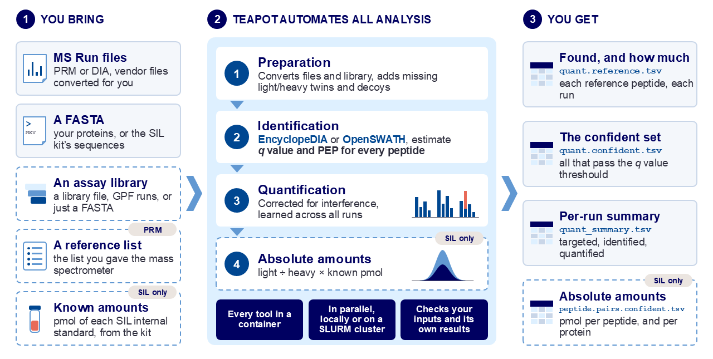

# TEAPOT

**T**argeted **E**valuation & **A**nalysis **P**ipeline **O**n **T**andem mass spectrometry

TEAPOT is an analysis pipeline for large-scale MS-based targeted proteomics, on
both PRM and DIA data. It scales to cohorts of thousands of runs, processed in a
single automated pass, reproducibly, on a local machine or an HPC cluster.

Every peptide is assigned a $q$ value and a posterior error probability (PEP), and
abundances are corrected for interference. Label-free runs give relative
abundances; SIL internal standards of known amount give absolute abundances.
Quantification accuracy improves as more runs are added to a cohort.

## Highlights

* **No manual work.** Targeted PRM is typically analyzed manually in Skyline.
  TEAPOT runs PRM and DIA analyses end to end, in parallel, at cohort scale.
* **From instrument files to results.** Which peptides were detected, at what
  confidence, and how much of each. Nothing for you to prepare in advance or
  hand in between.
* **Bring whatever you have.** An existing library (`.elib`, `.blib` or `.dlib`),
  Gas-Phase Fractionation (GPF) runs, or just a FASTA. TEAPOT puts it
  into the form the search needs.
* **Confidence on every peptide.** A $q$ value and a PEP for every identification.
* **Abundances corrected for interferences.** Peptides are quantified using
  evidence from all runs in the cohort, with interferences separated from
  their real signal.

---

## Does TEAPOT fit your data?

| you have | you get |
|---|---|
| PRM runs, and a reference list of the peptides you care about | which of them were detected at a 1 % $q$ value, and how much of each |
| PRM runs, plus SIL internal standards of known amount | the same, and an absolute amount in pmol |
| DIA runs | the same, across the whole assay library instead of a reference list |

## How TEAPOT works



### Reference and background peptides

Two terms run through the input templates and the rest of this page.

**Reference peptides** are the ones you want quantities for: in a label-free run
the peptides the mass spectrometer was scheduled to acquire, in a SIL run the
heavy internal standards and their endogenous light counterparts. **Background
peptides** are the other peptides present in the sample that you do not need
quantities for.

Context and Context-MS need both to estimate confidence, so your library has to
cover both. Most libraries do, but a vendor `.blib` of SIL internal standards is
reference-only. With such a library you need to supply a background if you search
it with EncyclopeDIA on PRM data, or with OpenSWATH on PRM data using Context-MS.

## Quick start

### Requirements

* Nextflow 23.04 or newer, and Java 17 or newer
* Apptainer

### Which workflow to use

| your data | recommended workflow | alternative |
|---|---|---|
| Label-free targeted PRM | `encyclopedia_prm_label_free` | `openswath_prm_label_free` |
| Targeted PRM with SIL internal standards, absolute quant | `encyclopedia_dia` | `encyclopedia_prm_sil_standards`, `openswath_prm_sil_standards` |
| Wide-window DIA | `encyclopedia_dia` | `openswath_dia` |

Then set up a run from it: copy the workflow's templates into your own working
directory and fill in every placeholder:

* its `.csv` samplesheet and `.yml` of settings, from [`templates/`](templates)
* a launcher, [`run_local.sh`](templates/run_local.sh) for one local machine or
  [`run_slurm.sh`](templates/run_slurm.sh) for an HPC cluster

On an HPC cluster, two more edits: your SLURM account in
[`conf/slurm.config`](conf/slurm.config), and your cluster's Java and Nextflow
module names in `run_slurm.sh`.

### What you need to supply

* **A samplesheet CSV.** One row per run, with the header
  `sample_id,file,mode,reference_list,engine`:
  - `mode` is `PRM` or `DIA`
  - `engine` is `encyclopedia` or `openswath`
  - `reference_list` is your list of reference peptides, and can be left empty
    when the pipeline can derive it (see below)

* **Run files**, named in the samplesheet's `file` column. Either an open format
  (`.mzML`, `.mzXML`) or a vendor format the pipeline converts for you: `.raw`
  (Thermo), `.wiff` (SCIEX), `.d` (Bruker/Agilent), `.lcd` (Shimadzu). A `.wiff`
  is not a single file. Name only the `.wiff` and keep its paired `.wiff.scan`
  in the same directory, and the pipeline picks it up automatically.

* **An assay library**, as any one of:
  - a library you already have: `.elib`, `.blib` or `.dlib`, or with OpenSWATH
    a `.pqp`, transition `.tsv` or TraML
  - Gas-Phase Fractionation (GPF) runs, listed in a CSV as in
    [`templates/library_sheet.csv`](templates/library_sheet.csv), and the
    pipeline builds a chromatogram library (`.elib`) from them
  - nothing, and the pipeline predicts one from your FASTA

* **Sequences in FASTA.** For label-free PRM and DIA runs, the proteins
  potentially present in your samples. For SIL runs, the standard construct
  sequences supplied with the vendor kit.

* **A background**, if you need one (see [Reference and background
  peptides](#reference-and-background-peptides)). Either a library (`.elib`,
  `.blib` or `.dlib`) or a FASTA of background proteins.

* **A reference list**, for PRM runs. Either name it in the samplesheet's
  `reference_list` column, or supply a vendor `.blib` and the pipeline derives
  one from it. This is typically the list you gave the mass spectrometer when
  setting up the acquisition. DIA runs do not need one.

* **Known amounts**, only for absolute quantification. The pmol of each SIL
  internal standard, usually supplied with the vendor kit and read as-is by the
  pipeline.

[INPUTS.md](INPUTS.md) has the layout and requirements of every input.

### Commands

```bash
# 1. get the pipeline
git clone https://github.com/zyqqqq0122/teapot.git
TEAPOT_DIR=$PWD/teapot

# 2. work from a directory of your own, not the pipeline checkout
mkdir -p ~/my_analysis && cd ~/my_analysis

# 3. copy the templates that matches your data, from the table above
cp $TEAPOT_DIR/templates/encyclopedia_prm_label_free.yml my_run.yml
cp $TEAPOT_DIR/templates/encyclopedia_prm_label_free.csv my_samplesheet.csv
cp $TEAPOT_DIR/templates/run_slurm.sh .        # or cp $TEAPOT_DIR/templates/run_local.sh . on a local machine

# 4. edit the three files as described above

# 5. run it
sbatch run_slurm.sh                            # or ./run_local.sh on a local machine
```

### How to read the results

```
results/
  quant/<route>/
    quant.reference.tsv          one row per reference peptide per run: found or not, and how much
    peptide.pairs.confident.tsv  light/heavy pairs and absolute pmol, SIL runs only
    ...                          the full table, the confident subset, and a per-run summary
  pipeline_info/                 logs, timings, software versions, the Nextflow report
  ...                            intermediates from every step
```

`<route>` names the engine and acquisition mode. For example, `enc_prm` is
EncyclopeDIA on PRM runs.

[OUTPUTS.md](OUTPUTS.md) describes every file and column.

## Getting help

* [INPUTS.md](INPUTS.md): every input file, its layout and accepted columns
* [OUTPUTS.md](OUTPUTS.md): every file in `results/`, and every column in it
* [PARAMETERS.md](PARAMETERS.md): every parameter, its default and when to change it
* [ARCHITECTURE.md](ARCHITECTURE.md): how the pipeline is built, for developers

## License

MIT
